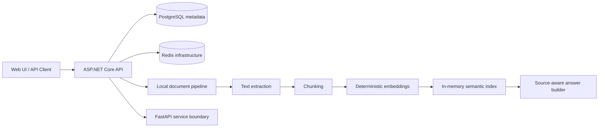

# Enterprise AI Document Assistant

[](https://github.com/mahdiaghtaee/enterprise-ai-document-assistant/actions/workflows/ci.yml)
[](LICENSE)

A local-first reference implementation for document ingestion, deterministic semantic retrieval, and source-aware answers.

The repository combines **ASP.NET Core**, **Python FastAPI**, **PostgreSQL**, **Redis**, a small Web UI, and **Docker Compose**. The current deterministic document pipeline runs inside the ASP.NET Core API so it can be inspected and tested without external AI credentials. The FastAPI service currently exposes health and indexing-boundary endpoints and is the extension point for future Python-specific document or model integrations.

```text
Upload -> Persist metadata -> Extract -> Chunk -> Embed -> Search -> Answer with sources
```

## Current Scope

Implemented:

- ASP.NET Core REST API with Swagger/OpenAPI
- local document storage and PostgreSQL-backed document metadata
- plain-text extraction and fixed-size chunking
- deterministic local embeddings
- in-memory semantic index with similarity ranking
- semantic search and source-aware ask endpoints
- FastAPI service boundary with health and indexing endpoints
- Redis infrastructure for future caching and background work
- Web UI, sample documents, demo script, integration tests, and CI

Not implemented yet:

- durable vector storage
- background indexing and retries
- authentication, authorization, or tenant isolation
- production language-model integration
- audit logging and distributed observability

The project must not be used for confidential or regulated documents until those controls are added. See [SECURITY.md](SECURITY.md).

## Quick Start

### Requirements

- Docker Desktop or Docker Engine with Compose
- Git

### Start the stack

```bash
git clone https://github.com/mahdiaghtaee/enterprise-ai-document-assistant.git
cd enterprise-ai-document-assistant
cp .env.example .env   # Windows PowerShell: Copy-Item .env.example .env
docker compose up --build
```

The `.env` file is optional when the default local ports and development credentials are acceptable.

| Service | Address |
|---|---|
| Web UI | `http://localhost:3000` |
| Swagger / OpenAPI | `http://localhost:5000/swagger` |
| ASP.NET Core health | `http://localhost:5000/health` |
| FastAPI health | `http://localhost:8000/health` |

Run the demo:

```bash
python scripts/demo_flow.py
```

Run the .NET integration tests:

```bash
dotnet test tests/api-dotnet/EnterpriseDocumentAssistant.Api.Tests.csproj
```

Detailed setup and troubleshooting are in [docs/LOCAL_DEVELOPMENT.md](docs/LOCAL_DEVELOPMENT.md).

## Architecture



The ASP.NET Core API currently owns the executable deterministic workflow. The FastAPI service is intentionally small: it proves the HTTP boundary and leaves room for future Python libraries or model providers without claiming that those capabilities already exist.

Architecture details:

- [Architecture overview](docs/ARCHITECTURE.md)
- [Engineering case study](docs/CASE_STUDY.md)
- [Local-first architecture decision](docs/adr/0001-local-first-document-intelligence.md)
- [Roadmap](docs/ROADMAP.md)

## API Workflow

### Upload

`POST /api/documents/upload`

The API validates and stores the file, persists metadata, extracts text, creates chunks, generates deterministic embeddings, and writes them to the in-memory semantic index. It also calls the FastAPI indexing endpoint to exercise the service boundary.

### Search

`POST /api/documents/search`

The API embeds the query with the same deterministic generator and returns the highest-scoring indexed chunks with source metadata.

### Ask

`POST /api/documents/ask`

The API retrieves relevant chunks and constructs a deterministic answer containing source context. This demonstrates retrieval and attribution; it is not presented as production LLM output.

## Current Limitations

- Indexed chunks are lost when the API process restarts.
- Only the supported local text-extraction path is implemented.
- Processing is synchronous.
- The FastAPI service does not yet perform extraction, embedding, or retrieval.
- Authentication, authorization, tenant isolation, and audit logging are absent.
- Docker Compose uses development defaults and exposes local ports.

The next major milestone is [pgvector-backed persistent semantic indexing](https://github.com/mahdiaghtaee/enterprise-ai-document-assistant/issues/41).

## Repository Structure

| Area | Responsibility |
|---|---|
| `src/api-dotnet/` | Public API, metadata persistence, local deterministic document pipeline |
| `src/ai-service-python/` | FastAPI boundary for future Python-specific processing |
| `src/web-ui/` | Demonstration interface |
| `infra/postgres/` | Local database initialization |
| `tests/api-dotnet/` | API and pipeline integration tests |
| `scripts/` | End-to-end demonstration flow |
| `samples/` | Uploadable example documents |
| `docs/` | Architecture, operations, security, and roadmap |

## Contributing

Focused contributions are welcome for tests, validation, documentation, persistent vector storage, background processing, observability, and security hardening.

Read [CONTRIBUTING.md](CONTRIBUTING.md) before opening a pull request. Report security-sensitive findings through [SECURITY.md](SECURITY.md).

## License

Released under the [MIT License](LICENSE).
