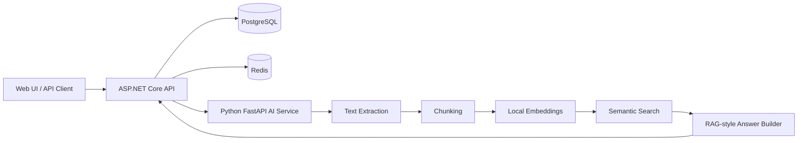

# Enterprise AI Document Assistant

[](https://github.com/mahdiaghtaee/enterprise-ai-document-assistant/actions/workflows/ci.yml)
[](LICENSE)
[](https://github.com/mahdiaghtaee/enterprise-ai-document-assistant/stargazers)

A practical, open-source reference implementation for building enterprise document assistants with **ASP.NET Core**, **Python FastAPI**, **PostgreSQL**, **Redis**, **Docker Compose**, semantic search, and Retrieval-Augmented Generation concepts.

The project demonstrates the complete document journey:

```text
Upload -> Extract -> Chunk -> Embed -> Search -> Ask -> Return grounded sources
```

> The current implementation is fully local and deterministic. It demonstrates the architecture without requiring a paid LLM or embedding provider.

## Why This Project Exists

Many RAG examples focus only on a short Python notebook. Enterprise systems usually need more: a backend API, document lifecycle, persistence, service boundaries, validation, health checks, tests, infrastructure, and a usable demonstration flow.

This repository provides a readable multi-service foundation that can be studied, extended, and adapted for internal knowledge bases, policy assistants, contract search, HR portals, and other document-heavy business applications.

## Quick Start

### Requirements

- Docker Desktop or Docker Engine with Compose
- Git

### Run the complete stack

```bash
git clone https://github.com/mahdiaghtaee/enterprise-ai-document-assistant.git
cd enterprise-ai-document-assistant
docker compose up --build
```

After startup:

| Service | Address |
|---|---|
| Web UI | `http://localhost:3000` |
| Swagger / OpenAPI | `http://localhost:5000/swagger` |
| ASP.NET Core health endpoint | `http://localhost:5000/health` |

Run the end-to-end demo:

```bash
python scripts/demo_flow.py
```

Run the .NET integration tests:

```bash
dotnet test tests/api-dotnet/EnterpriseDocumentAssistant.Api.Tests.csproj
```

## Architecture



The .NET API coordinates document metadata and public endpoints. The Python service handles text processing, chunking, local embedding generation, retrieval, and deterministic answer construction. PostgreSQL stores document metadata, while Redis provides infrastructure for future caching and background workflows.

Detailed architecture documentation:

- [`docs/ARCHITECTURE.md`](docs/ARCHITECTURE.md)
- [`docs/ARCHITECTURE_DIAGRAM.md`](docs/ARCHITECTURE_DIAGRAM.md)
- [`docs/LOCAL_DEVELOPMENT.md`](docs/LOCAL_DEVELOPMENT.md)

## Implemented Features

- Simple Web UI for health checks, uploads, document listing, search, questions, and source inspection
- ASP.NET Core REST API with Swagger/OpenAPI
- Python FastAPI document-processing service
- PostgreSQL-backed document metadata repository
- Text extraction and configurable chunking flow
- Deterministic local embedding generation
- In-memory semantic index and document search
- RAG-style ask endpoint with source attribution
- Docker Compose development environment
- Redis infrastructure service
- Health-check endpoints and structured service boundaries
- Runnable end-to-end demo script
- Sample HR, contract, and business-policy documents
- API integration tests
- GitHub Actions CI
- Contribution guide, issue templates, and MIT license

## Example Use Cases

- Internal policy and procedure assistant
- HR handbook search
- Contract and compliance document exploration
- Customer-support knowledge base
- Technical documentation assistant
- Private enterprise knowledge portal
- Reference architecture for .NET and Python AI integration

## Current Scope

The current answer path is intentionally deterministic and local. No external LLM provider is required. This makes the repository easy to run, inspect, test, and extend.

The next production-oriented milestones are:

- Authentication and role-based access control
- Persistent vector storage such as PostgreSQL with pgvector
- External or local LLM provider abstraction
- Background document-indexing workflow
- OpenTelemetry tracing and metrics
- Audit logging
- Docker and deployment hardening
- Additional validation, resilience, and CI quality gates

## Repository Structure

| Area | Responsibility |
|---|---|
| ASP.NET Core API | Public endpoints, orchestration, metadata persistence |
| Python FastAPI service | Extraction, chunking, embeddings, retrieval, answer generation |
| PostgreSQL | Document metadata and future vector persistence |
| Redis | Cache and background-processing foundation |
| Web UI | Demonstration interface for the complete workflow |
| `scripts/` | Automated and manual end-to-end demo flows |
| `samples/` | Uploadable business documents |
| `docs/` | Architecture, API examples, operations, and roadmap |

## Documentation

- [`docs/API_EXAMPLES.md`](docs/API_EXAMPLES.md) — request and response examples
- [`docs/RAG_ASK_ENDPOINT.md`](docs/RAG_ASK_ENDPOINT.md) — ask-flow behavior and implementation notes
- [`docs/DEMO_SCENARIO.md`](docs/DEMO_SCENARIO.md) — business-focused demonstration narrative
- [`docs/SWAGGER_DEMO_NOTES.md`](docs/SWAGGER_DEMO_NOTES.md) — Swagger presentation guide
- [`docs/HEALTH_AND_OBSERVABILITY.md`](docs/HEALTH_AND_OBSERVABILITY.md) — health, logging, metrics, and audit direction
- [`docs/RELEASE_NOTES_v0.1.0.md`](docs/RELEASE_NOTES_v0.1.0.md) — initial milestone notes

## Technology Stack

| Area | Technology |
|---|---|
| Web UI | HTML, CSS, JavaScript, Nginx |
| Backend API | ASP.NET Core |
| AI service | Python, FastAPI |
| Database | PostgreSQL, Npgsql |
| Cache / infrastructure | Redis |
| API documentation | Swagger / OpenAPI |
| Local environment | Docker Compose |
| Tests | xUnit and ASP.NET Core integration testing |
| AI architecture | RAG, semantic search, document indexing |

## Contributing

Contributions are welcome. Good starting points include documentation improvements, sample documents, validation, tests, Docker improvements, observability, and persistent vector storage.

Read [`CONTRIBUTING.md`](CONTRIBUTING.md) before opening a pull request.

## Support the Project

If this repository helps you learn or build a document assistant, consider starring it. Stars make the project easier for other .NET, Python, and enterprise AI developers to discover.

## License

Released under the [MIT License](LICENSE).

## Author

**Mahdi Aghtaee**  
Senior C#/.NET developer focused on enterprise backend systems, AI-enabled applications, RAG architecture, SQL systems, and production-oriented software design.
