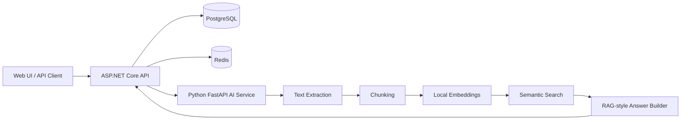

# Enterprise AI Document Assistant

[](https://github.com/mahdiaghtaee/enterprise-ai-document-assistant/actions/workflows/ci.yml)
[](LICENSE)
[](https://github.com/mahdiaghtaee/enterprise-ai-document-assistant/stargazers)

I built this project to explore how a document assistant can fit into a real enterprise backend rather than remain a standalone AI demo.

It combines **ASP.NET Core**, **Python FastAPI**, **PostgreSQL**, **Redis**, and **Docker Compose** in a local-first document workflow:

```text
Upload -> Extract -> Chunk -> Embed -> Search -> Ask -> Return grounded sources
```

The current implementation uses deterministic local embeddings and a deterministic answer path. It can be run and tested without a paid AI provider, while leaving clear extension points for pgvector, background indexing, authentication, observability, and external or local language models.

- [Read the engineering case study](docs/CASE_STUDY.md)
- [Review the architecture](docs/ARCHITECTURE.md)
- [See the first architecture decision](docs/adr/0001-local-first-document-intelligence.md)
- [Review the security scope](SECURITY.md)

## Why I Built It

A useful internal document assistant needs more than a chat endpoint. It needs document lifecycle management, persistence, service boundaries, validation, health checks, testable contracts, source attribution, and a development environment that another engineer can reproduce.

This repository is my working reference for those concerns. It is suitable for studying or extending into internal policy search, HR knowledge bases, contract exploration, support documentation, and private document Q&A systems.

## Quick Start

### Requirements

- Docker Desktop or Docker Engine with Compose
- Git

### Run the complete stack

```bash
git clone https://github.com/mahdiaghtaee/enterprise-ai-document-assistant.git
cd enterprise-ai-document-assistant
docker compose up --build
```

After startup:

| Service | Address |
|---|---|
| Web UI | `http://localhost:3000` |
| Swagger / OpenAPI | `http://localhost:5000/swagger` |
| ASP.NET Core health endpoint | `http://localhost:5000/health` |

Run the end-to-end demo:

```bash
python scripts/demo_flow.py
```

Run the .NET integration tests:

```bash
dotnet test tests/api-dotnet/EnterpriseDocumentAssistant.Api.Tests.csproj
```

## Architecture



The .NET API coordinates document metadata and public endpoints. The Python service handles text processing, chunking, local embedding generation, retrieval, and deterministic answer construction. PostgreSQL stores document metadata. Redis is included as infrastructure for future caching and background workflows.

Detailed documentation:

- [`docs/CASE_STUDY.md`](docs/CASE_STUDY.md) — problem, approach, trade-offs, and interview discussion points
- [`docs/ARCHITECTURE.md`](docs/ARCHITECTURE.md) — service responsibilities and request flows
- [`docs/ARCHITECTURE_DIAGRAM.md`](docs/ARCHITECTURE_DIAGRAM.md) — expanded architecture diagram
- [`docs/LOCAL_DEVELOPMENT.md`](docs/LOCAL_DEVELOPMENT.md) — local setup and troubleshooting
- [`docs/adr/0001-local-first-document-intelligence.md`](docs/adr/0001-local-first-document-intelligence.md) — local-first pipeline decision

## Implemented Features

- Web UI for health checks, uploads, document listing, search, questions, and source inspection
- ASP.NET Core REST API with Swagger/OpenAPI
- Python FastAPI document-processing service
- PostgreSQL-backed document metadata repository
- Text extraction and chunking flow
- Deterministic local embedding generation
- In-memory semantic index and document search
- RAG-style ask endpoint with source attribution
- Docker Compose development environment
- Redis infrastructure service
- Health-check endpoints and explicit service boundaries
- Runnable end-to-end demo script
- Sample HR, contract, and business-policy documents
- API integration tests
- GitHub Actions CI
- Contribution guide, security policy, issue templates, and MIT license

## Example Use Cases

- Internal policy and procedure assistant
- HR handbook search
- Contract and compliance document exploration
- Customer-support knowledge base
- Technical documentation assistant
- Private enterprise knowledge portal
- Reference architecture for .NET and Python AI integration

## Current Limitations

I keep the current limitations visible because they are important engineering decisions, not details to hide:

- The vector index is currently in memory and is not durable across restarts.
- Document processing is synchronous and should move to background workers for production workloads.
- The project does not yet include authentication, authorization, or tenant isolation.
- Docker Compose contains development-only credentials and exposed ports.
- The deterministic answer path demonstrates retrieval and source attribution, not production LLM quality.

The next production-oriented work includes:

- PostgreSQL with pgvector for persistent vector storage
- Background indexing with explicit states and retries
- Authentication, role-based authorization, and workspace isolation
- External and local LLM provider abstractions
- OpenTelemetry tracing and metrics
- Audit logging and document-access events
- Deployment and secret-management hardening

## Repository Structure

| Area | Responsibility |
|---|---|
| ASP.NET Core API | Public endpoints, orchestration, metadata persistence |
| Python FastAPI service | Extraction, chunking, embeddings, retrieval, answer generation |
| PostgreSQL | Document metadata and future vector persistence |
| Redis | Cache and background-processing foundation |
| Web UI | Demonstration interface for the complete workflow |
| `scripts/` | Automated and manual end-to-end demo flows |
| `samples/` | Uploadable business documents |
| `docs/` | Architecture, decisions, API examples, operations, and roadmap |

## API and Demo Documentation

- [`docs/API_EXAMPLES.md`](docs/API_EXAMPLES.md) — request and response examples
- [`docs/RAG_ASK_ENDPOINT.md`](docs/RAG_ASK_ENDPOINT.md) — ask-flow behavior and implementation notes
- [`docs/DEMO_SCENARIO.md`](docs/DEMO_SCENARIO.md) — business-focused demonstration narrative
- [`docs/SWAGGER_DEMO_NOTES.md`](docs/SWAGGER_DEMO_NOTES.md) — Swagger presentation guide
- [`docs/HEALTH_AND_OBSERVABILITY.md`](docs/HEALTH_AND_OBSERVABILITY.md) — health, logging, metrics, and audit direction
- [`docs/RELEASE_NOTES_v0.1.0.md`](docs/RELEASE_NOTES_v0.1.0.md) — initial milestone notes

## Technology Stack

| Area | Technology |
|---|---|
| Web UI | HTML, CSS, JavaScript, Nginx |
| Backend API | ASP.NET Core |
| AI service | Python, FastAPI |
| Database | PostgreSQL, Npgsql |
| Cache / infrastructure | Redis |
| API documentation | Swagger / OpenAPI |
| Local environment | Docker Compose |
| Tests | xUnit and ASP.NET Core integration testing |
| AI architecture | RAG, semantic search, document indexing |

## Contributing

Contributions are welcome when they improve the project as an engineering reference. Useful areas include documentation, tests, validation, Docker improvements, observability, background processing, and persistent vector storage.

Read [`CONTRIBUTING.md`](CONTRIBUTING.md) before opening a pull request. Security-sensitive findings should follow [`SECURITY.md`](SECURITY.md).

## License

Released under the [MIT License](LICENSE).

## Author

**Mahdi Aghtaee**  
Senior C#/.NET developer focused on enterprise backend systems, AI-enabled applications, RAG architecture, SQL systems, and production-oriented software design.

If the architecture or documentation is useful to you, a star helps other engineers find the project.
