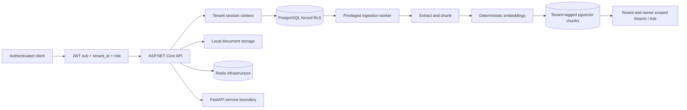

# Enterprise AI Document Assistant

[](https://github.com/mahdiaghtaee/enterprise-ai-document-assistant/actions/workflows/ci.yml)
[](LICENSE)

A local-first reference implementation for tenant-isolated document ingestion, durable background processing, persistent semantic retrieval, and source-aware answers.

The repository combines **ASP.NET Core**, **Python FastAPI**, **PostgreSQL with pgvector**, **Redis**, a small Web UI, and **Docker Compose**. The deterministic document pipeline runs in an ASP.NET Core hosted worker and can be tested without external AI credentials.

```text
JWT tenant/user -> RLS-scoped upload -> Atomic enqueue -> Background extraction/indexing -> Tenant-scoped retrieval -> Answer with sources
```

## Current Scope

Implemented:

- ASP.NET Core REST API with Swagger/OpenAPI
- fail-closed JWT validation for issuer, audience, signature, lifetime, `sub`, `tenant_id`, and role
- tenant-scoped `User` and `Admin` roles plus explicit cross-tenant `PlatformAdmin`
- immutable document owner and tenant identity derived from JWT claims
- owner-filtered access for ordinary users and tenant-wide access for tenant administrators
- PostgreSQL Row-Level Security on documents, semantic chunks, and ingestion jobs
- separate non-superuser runtime and privileged PostgreSQL roles
- direct negative database tests for cross-tenant reads, writes, and missing tenant context
- local document storage and PostgreSQL-backed metadata
- atomic document metadata and initial ingestion-job persistence
- durable `Pending`, `Processing`, `Completed`, and `Failed` job states
- transactional job claiming with PostgreSQL `FOR UPDATE SKIP LOCKED`
- hosted background extraction, chunking, embedding, and semantic-index persistence
- bounded delayed retries, graceful shutdown, and abandoned-job recovery
- authenticated processing-status, semantic search, and source-aware Ask endpoints
- plain-text extraction and deterministic eight-dimensional local embeddings
- configurable in-memory or PostgreSQL/pgvector semantic index
- persistence and authorization checks across API-container restarts
- FastAPI integration boundary, Redis infrastructure, Web UI, demo script, CI, CodeQL, and Dependency Review

Not implemented yet:

- tenant provisioning, memberships, invitations, domain verification, or quotas
- production identity-provider synchronization, key rotation, or token revocation
- audit logging, correlation identifiers, OpenTelemetry, and operational metrics
- encrypted document storage and centralized secret management
- production language-model or embedding-provider integration
- retrieval-quality evaluation on a representative corpus
- PDF, DOCX, OCR, malware scanning, or file-signature validation

Tenant isolation reduces cross-organization disclosure risk, but this reference project must not be used for confidential or regulated documents until audit, encryption, secret-management, identity-lifecycle, and operational controls are completed. See [SECURITY.md](SECURITY.md).

## Quick Start

### Requirements

- Docker Desktop or Docker Engine with Compose
- Git
- Python 3.11+ for the local token helper and demo script

### Start the stack

```bash
git clone https://github.com/mahdiaghtaee/enterprise-ai-document-assistant.git
cd enterprise-ai-document-assistant
cp .env.example .env   # Windows PowerShell: Copy-Item .env.example .env
docker compose up --build
```

Docker Compose uses separate local PostgreSQL credentials for the tenant-restricted API path and the privileged worker/platform path. The values in `.env.example` are development-only.

| Service | Address |
|---|---|
| Web UI | `http://localhost:3000` |
| Swagger / OpenAPI | `http://localhost:5000/swagger` |
| ASP.NET Core health | `http://localhost:5000/health` |
| FastAPI health | `http://localhost:8000/health` |

Generate a tenant-scoped development token:

```bash
python scripts/create_dev_token.py --user demo-user --tenant demo-tenant --role User
```

Generate a tenant administrator token:

```bash
python scripts/create_dev_token.py --user demo-admin --tenant demo-tenant --role Admin
```

Paste the token into Swagger or the Web UI. The helper and repository signing key are local-development tools, not an identity provider.

Run the authenticated demo:

```bash
python scripts/demo_flow.py
```

Run the .NET tests:

```bash
dotnet test tests/api-dotnet/EnterpriseDocumentAssistant.Api.Tests.csproj
```

Detailed setup and migration guidance:

- [Local development](docs/LOCAL_DEVELOPMENT.md)
- [Authentication and authorization](docs/AUTHENTICATION_AND_AUTHORIZATION.md)
- [Tenant isolation](docs/TENANT_ISOLATION.md)

## Architecture


```mermaid
flowchart LR
    U[Authenticated client] --> J[JWT sub + tenant_id + role]
    J --> A[ASP.NET Core API]
    A --> T[Tenant session context]
    T --> P[(PostgreSQL forced RLS)]
    A --> S[Local document storage]
    P --> W[Privileged ingestion worker]
    W --> X[Extract and chunk]
    X --> E[Deterministic embeddings]
    E --> V[(Tenant-tagged pgvector chunks)]
    V --> Q[Tenant and owner scoped Search / Ask]
    A --> R[(Redis infrastructure)]
    A --> F[FastAPI service boundary]
```

The API derives `owner_id` from `sub` and `tenant_id` from the JWT. Runtime PostgreSQL transactions set a transaction-local `app.tenant_id`; forced RLS independently limits documents, chunks, and jobs. `User` requests add an owner filter, `Admin` bypasses only that owner filter, and `PlatformAdmin` uses the explicit privileged connection.

Background processing preserves the stored owner and tenant when generating semantic-index records. Composite foreign keys prevent a chunk or ingestion job from being associated with a different tenant than its document.

Architecture details:

- [Tenant isolation](docs/TENANT_ISOLATION.md)
- [Authentication and authorization](docs/AUTHENTICATION_AND_AUTHORIZATION.md)
- [Architecture overview](docs/ARCHITECTURE.md)
- [pgvector semantic index](docs/PGVECTOR_SCHEMA.md)
- [Background ingestion](docs/BACKGROUND_INGESTION.md)
- [Engineering case study](docs/CASE_STUDY.md)
- [Roadmap](docs/ROADMAP.md)

## API Security Behavior

Every `/api/documents` endpoint requires `Authorization: Bearer <token>`. `GET /health` remains public.

`GET /api/auth/me` returns the authenticated user, tenant, roles, tenant-wide owner access, and cross-tenant access state.

For document operations:

- `User`: own documents inside the token tenant;
- `Admin`: all owners inside the token tenant;
- `PlatformAdmin`: all tenants through the privileged path;
- missing token: `401`;
- missing required claims or role: `403`;
- document outside authorized owner or tenant scope: `404`.

Search and Ask apply the same database and owner boundaries before returning source text.

## Persistence and Isolation Verification

CI verifies:

- JWT claim and role enforcement;
- user isolation across owners and tenants;
- tenant administrator access only inside one tenant;
- platform administrator cross-tenant access;
- forced RLS and non-`BYPASSRLS` runtime roles;
- direct rejection of cross-tenant database writes;
- fail-closed reads without tenant session context;
- tenant identity on documents, chunks, and ingestion jobs;
- successful upload, processing, retrieval, and authorization after API restart.

## Current Limitations

- Only the supported local plain-text extraction path is implemented.
- Tenant lifecycle and membership management are not implemented.
- The privileged worker/platform credentials are still loaded by the same API process in Docker Compose; a production design should separate that trust boundary.
- Audit logging, token revocation, managed key rotation, encrypted storage, and external identity-provider integration remain absent.
- The deterministic embedding model is intended for reproducible development, not production retrieval quality.
- Docker Compose uses development defaults and exposes local ports.

The next major priority is auditability and observability: durable audit events, correlation identifiers, OpenTelemetry traces, and operational metrics.

## Repository Structure

| Area | Responsibility |
|---|---|
| `src/api-dotnet/` | Authentication, tenant policies, public API, ingestion worker, persistence, document pipeline, semantic-index providers |
| `src/ai-service-python/` | FastAPI boundary for future Python-specific processing |
| `src/web-ui/` | Authenticated demonstration interface |
| `infra/postgres/` | PostgreSQL roles, RLS, ownership, pgvector, and ingestion initialization |
| `tests/api-dotnet/` | API, security, RLS, provider, pipeline, and PostgreSQL lifecycle tests |
| `scripts/` | Tenant-aware local token helper and end-to-end demo |
| `samples/` | Uploadable example documents |
| `docs/` | Architecture, security, migrations, operations, and roadmap |

## Contributing

Focused contributions are welcome for auditability, observability, tenant lifecycle, retrieval evaluation, and safe document-format expansion.

Read [CONTRIBUTING.md](CONTRIBUTING.md) before opening a pull request. Report security-sensitive findings through [SECURITY.md](SECURITY.md).

## License

Released under the [MIT License](LICENSE).
