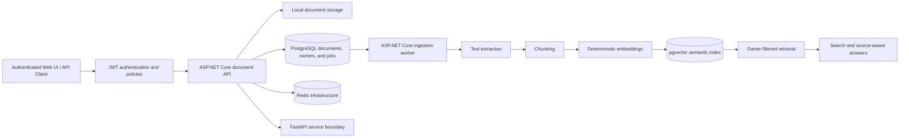

# Enterprise AI Document Assistant

[](https://github.com/mahdiaghtaee/enterprise-ai-document-assistant/actions/workflows/ci.yml)
[](LICENSE)

A local-first reference implementation for authenticated document ingestion, durable background processing, persistent semantic retrieval, and source-aware answers.

The repository combines **ASP.NET Core**, **Python FastAPI**, **PostgreSQL with pgvector**, **Redis**, a small Web UI, and **Docker Compose**. The deterministic document pipeline runs in an ASP.NET Core hosted worker and can be tested without external AI credentials. FastAPI remains a boundary for future Python-specific document or model integrations.

```text
JWT user -> Upload -> Store file -> Atomically enqueue with owner -> Background extract/chunk/embed -> Persist vectors -> Authorized search -> Answer with sources
```

## Current Scope

Implemented:

- ASP.NET Core REST API with Swagger/OpenAPI
- JWT bearer authentication with issuer, audience, signature, and lifetime validation
- `User` and `Admin` role-based authorization
- immutable document ownership derived from the JWT `sub` claim
- owner-filtered document listing, processing status, semantic search, and grounded answers
- negative security tests for unauthenticated and cross-user access
- local document storage and PostgreSQL-backed document metadata
- atomic document metadata and initial ingestion-job persistence
- durable `Pending`, `Processing`, `Completed`, and `Failed` job states
- transactional job claiming with PostgreSQL `FOR UPDATE SKIP LOCKED`
- hosted background extraction, chunking, embedding, and semantic-index persistence
- bounded delayed retries and abandoned-job recovery
- graceful-shutdown return to the queue without consuming an attempt
- authenticated document processing-status API with controlled failure details
- plain-text extraction and fixed-size chunking
- deterministic eight-dimensional local embeddings
- configurable in-memory or PostgreSQL/pgvector semantic index
- pgvector cosine-similarity search with source metadata
- indexed chunks that survive API container restarts in Docker Compose
- FastAPI health and indexing-boundary endpoints
- Redis infrastructure for future caching or coordination
- Web UI, sample documents, authenticated demo script, integration tests, CI, CodeQL, and Dependency Review

Not implemented yet:

- tenant or workspace isolation
- production identity-provider integration, key rotation, or token revocation
- audit logging and distributed observability
- encrypted document storage and centralized secret management
- production language-model or embedding-provider integration
- retrieval-quality evaluation on a representative corpus
- PDF, DOCX, or OCR extraction

Authentication and document ownership reduce accidental cross-user access, but the project must not be used for confidential or regulated documents until tenant isolation, audit, encryption, secret-management, and operational controls are completed. See [SECURITY.md](SECURITY.md).

## Quick Start

### Requirements

- Docker Desktop or Docker Engine with Compose
- Git
- Python 3.11+ for the local token helper and demo script

### Start the stack

```bash
git clone https://github.com/mahdiaghtaee/enterprise-ai-document-assistant.git
cd enterprise-ai-document-assistant
cp .env.example .env   # Windows PowerShell: Copy-Item .env.example .env
docker compose up --build
```

Docker Compose explicitly selects the PostgreSQL semantic-index provider. Without `SemanticIndex:Provider`, the application defaults to the in-memory provider.

| Service | Address |
|---|---|
| Web UI | `http://localhost:3000` |
| Swagger / OpenAPI | `http://localhost:5000/swagger` |
| ASP.NET Core health | `http://localhost:5000/health` |
| FastAPI health | `http://localhost:8000/health` |

Generate a local development token:

```bash
python scripts/create_dev_token.py --user demo-user --role User
```

Paste the token into Swagger or the Web UI. The token helper and repository signing key are development-only.

Run the authenticated demo:

```bash
python scripts/demo_flow.py
```

Run the .NET tests:

```bash
dotnet test tests/api-dotnet/EnterpriseDocumentAssistant.Api.Tests.csproj
```

Detailed setup and migration guidance are in [docs/LOCAL_DEVELOPMENT.md](docs/LOCAL_DEVELOPMENT.md) and [docs/AUTHENTICATION_AND_AUTHORIZATION.md](docs/AUTHENTICATION_AND_AUTHORIZATION.md).

## Architecture


```mermaid
flowchart LR
    U[Authenticated Web UI / API Client] --> J[JWT authentication and policies]
    J --> A[ASP.NET Core document API]
    A --> S[Local document storage]
    A --> P[(PostgreSQL documents, owners, and jobs)]
    P --> W[ASP.NET Core ingestion worker]
    W --> X[Text extraction]
    X --> C[Chunking]
    C --> E[Deterministic embeddings]
    E --> V[(pgvector semantic index)]
    V --> Z[Owner-filtered retrieval]
    Z --> Q[Search and source-aware answers]
    A --> R[(Redis infrastructure)]
    A --> F[FastAPI service boundary]
```

The API validates the token, derives the owner from `sub`, stores the file, then creates document metadata and the initial `Pending` job in one PostgreSQL transaction. The hosted worker preserves ownership while advancing lifecycle state and persisting semantic-index records. Search, Ask, document listing, and status lookup use the same owner boundary. `Admin` tokens bypass only the owner filter.

Architecture details:

- [Authentication and authorization](docs/AUTHENTICATION_AND_AUTHORIZATION.md)
- [Architecture overview](docs/ARCHITECTURE.md)
- [pgvector semantic index](docs/PGVECTOR_SCHEMA.md)
- [Background ingestion](docs/BACKGROUND_INGESTION.md)
- [Engineering case study](docs/CASE_STUDY.md)
- [Local-first architecture decision](docs/adr/0001-local-first-document-intelligence.md)
- [Roadmap](docs/ROADMAP.md)

## API Workflow

Every `/api/documents` endpoint requires `Authorization: Bearer <token>`. `GET /health` remains public.

### Current principal

`GET /api/auth/me`

Returns the authenticated subject, roles, and whether the token can access documents across owners.

### Upload

`POST /api/documents/upload`

The API validates and stores the file, derives ownership from the JWT subject, then atomically persists document metadata and a `Pending` ingestion job. It returns `202 Accepted` with the document ID, job ID, and a processing-status URL. Extraction and indexing continue in the hosted worker.

If database enqueue fails after storage succeeds, the local file is removed to avoid an untracked storage orphan.

### Processing status

`GET /api/documents/{documentId}/processing-status`

Returns the current job state only when the authenticated user owns the document or has the `Admin` role. Foreign document identifiers return `404` to ordinary users.

### Search

`POST /api/documents/search`

The API embeds the query and returns the highest-scoring chunks visible to the authenticated user. The PostgreSQL provider applies the owner filter before ordering by pgvector cosine distance.

### Ask

`POST /api/documents/ask`

The API retrieves only authorized chunks and constructs a deterministic answer containing source context. This demonstrates retrieval and attribution; it is not presented as production LLM output.

## Retry and Recovery

Unexpected processing failures are retried after a configurable delay until the bounded attempt limit is reached. Known content or validation failures become terminal immediately.

The worker periodically recovers `Processing` jobs whose processing lease has expired. Jobs with attempts remaining return to `Pending`; exhausted jobs become `Failed`. See [the background ingestion documentation](docs/BACKGROUND_INGESTION.md) for configuration and state-transition details.

## Persistence and Isolation Check

CI verifies that:

- anonymous document requests return `401`;
- a document uploaded by one subject is retrievable by that subject;
- another ordinary subject receives no matching chunks;
- an `Admin` can retrieve across owners;
- ownership and indexed chunks remain effective after an API-container restart.

## Current Limitations

- Only the supported local plain-text extraction path is implemented.
- FastAPI does not yet perform extraction, embedding, retrieval, or answer generation.
- Tenant/workspace isolation, audit logging, token revocation, and external identity-provider integration remain absent.
- The deterministic embedding model is intended for reproducible development, not production retrieval quality.
- Background processing uses PostgreSQL as the durable queue; advanced scheduling and separate worker deployment are not implemented.
- Docker Compose uses development defaults and exposes local ports.

The next security priority is tenant/workspace isolation with database-enforced negative tests, followed by auditability and observability.

## Repository Structure

| Area | Responsibility |
|---|---|
| `src/api-dotnet/` | Authentication, authorization, public API, durable ingestion worker, metadata persistence, document pipeline, semantic-index providers |
| `src/ai-service-python/` | FastAPI boundary for future Python-specific processing |
| `src/web-ui/` | Authenticated demonstration interface |
| `infra/postgres/` | PostgreSQL, ownership, pgvector, and ingestion-job initialization |
| `tests/api-dotnet/` | API, security, provider, pipeline, and PostgreSQL lifecycle tests |
| `scripts/` | Local token helper and end-to-end demonstration flow |
| `samples/` | Uploadable example documents |
| `docs/` | Architecture, operations, security, and roadmap |

## Contributing

Focused contributions are welcome for tenant isolation, auditability, observability, retrieval evaluation, and safe document-format expansion.

Read [CONTRIBUTING.md](CONTRIBUTING.md) before opening a pull request. Report security-sensitive findings through [SECURITY.md](SECURITY.md).

## License

Released under the [MIT License](LICENSE).
