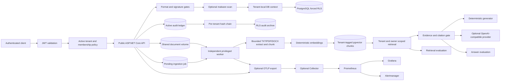

# Enterprise AI Document Assistant

[](https://github.com/mahdiaghtaee/enterprise-ai-document-assistant/actions/workflows/ci.yml)
[](https://github.com/mahdiaghtaee/enterprise-ai-document-assistant/actions/workflows/observability.yml)
[](https://github.com/mahdiaghtaee/enterprise-ai-document-assistant/actions/workflows/operational-observability.yml)
[](https://github.com/mahdiaghtaee/enterprise-ai-document-assistant/actions/workflows/retrieval-evaluation.yml)
[](https://github.com/mahdiaghtaee/enterprise-ai-document-assistant/actions/workflows/answer-evaluation.yml)
[](https://github.com/mahdiaghtaee/enterprise-ai-document-assistant/actions/workflows/document-formats.yml)
[](LICENSE)

A local-first reference implementation for managed tenant document ingestion, durable background processing, persistent semantic retrieval, provider-optional grounded answers, tamper-evident audit operations, and reproducible quality evaluation.

The repository combines **ASP.NET Core**, **Python FastAPI**, **PostgreSQL with pgvector**, **Redis**, a small Web UI, and **Docker Compose**. The default pipeline is deterministic and runs without paid AI credentials, a malware-scanning service, audit-retention deletion, or a telemetry collector. The public API and privileged ingestion worker run as separate services with different database identities.

```text
JWT subject/tenant -> Durable tenant + membership policy -> Tenant RLS -> Safe upload gates
                                                            |
Shared document volume <- Public API ------------------------+-> Privileged worker
          |                                                       |
          |                             TXT/PDF/DOCX extract/chunk/embed -> pgvector
          |                                                       |
          +-> Tamper-evident audit chain -> bounded archive       |
                                                                  |
Tenant-scoped retrieval -> Evidence/citation gate -> Answer + sources
          |                         |
          +-> Retrieval baseline    +-> Answer baseline
```

## Current Scope

Implemented:

- ASP.NET Core REST API with Swagger/OpenAPI
- fail-closed JWT validation for issuer, audience, signature, lifetime, `sub`, `tenant_id`, and role
- durable `tenants`, `tenant_memberships`, and `tenant_invitations` storage
- PlatformAdmin tenant provisioning, deactivation, and reactivation
- atomic tenant and initial Admin creation
- tenant-scoped `User` and `Admin` roles plus explicit cross-tenant `PlatformAdmin`
- active tenant and active durable membership checks on protected requests
- durable Admin enforcement that rejects stale elevated JWT claims
- member listing, role changes, removal, and final-Admin protection
- one-time invitation creation, listing, revocation, expiry, and authenticated acceptance
- SHA-256 invitation-token digests with plaintext returned only once
- immutable document owner and tenant identity derived from JWT claims
- forced PostgreSQL Row-Level Security on tenants, memberships, invitations, documents, semantic chunks, ingestion jobs, active audit events, and archived audit events
- separate non-superuser `document_app`, `document_platform`, and `document_privileged` roles
- a public API container without the privileged worker credential
- an independent ingestion-worker container with no published host port
- shared named-volume document storage between enqueue and processing
- explicit `Api`, `Worker`, and compatibility `Combined` hosting modes
- PostgreSQL-backed metadata and atomic document/job enqueue
- durable `Pending`, `Processing`, `Completed`, and `Failed` job states
- transactional job claiming with PostgreSQL `FOR UPDATE SKIP LOCKED`
- extension/MIME agreement plus actual PDF and DOCX package inspection before durable enqueue
- bounded strict UTF-8, PDF, and DOCX text extraction in the independent worker
- PDF page limits, DOCX archive/XML limits, total extracted-character limits, and cancellation-aware processing
- explicit `ocr-required` handling for image-only/scanned PDFs rather than empty indexing
- optional fail-closed ClamAV `INSTREAM` malware-scanning boundary with a service-free disabled local default
- background extraction, chunking, embedding, and semantic-index persistence
- bounded retries, graceful shutdown, and abandoned-job recovery
- authenticated processing-status, semantic search, and grounded Ask endpoints
- deterministic local extractive answer generation as the default
- optional OpenAI-compatible Chat Completions answer generation
- bounded question, source-count, and context-character provider inputs
- untrusted-source prompt boundaries and mandatory `[S#]` citations
- explicit missing, low-confidence, conflicting, and provider-declined evidence outcomes
- controlled timeout, rate-limit, provider-authentication, malformed-response, and ungrounded-response errors
- source metadata preserved independently from provider-generated text and failures
- validated `X-Correlation-ID` generation, echo, log-safe diagnostic linkage, and service propagation
- OpenTelemetry tracing and metrics for ASP.NET Core, HttpClient, runtime, Search, Ask, provider generation, upload, worker processing, and audit operations
- FastAPI OpenTelemetry request instrumentation and correlation propagation
- optional OTLP/HTTP export while retaining collector-free local execution
- structured JSON console logging with trace, span, correlation digest, document, tenant, and job context
- liveness and dependency-aware readiness endpoints
- append-only PostgreSQL audit ledger with forced tenant RLS
- database-generated per-tenant audit sequence, previous hash, and SHA-256 event hash
- transactionally serialized same-tenant audit-chain heads to prevent concurrent forks
- deterministic backfill of existing audit history
- tenant-RLS protected `audit_event_archive` that preserves original event IDs and chain fields
- integrity verification spanning active and archived audit rows
- `GET /api/audit/integrity` with own-tenant Admin scope and explicit-tenant PlatformAdmin scope
- bounded privileged audit archival without direct application-table DELETE privileges
- Worker-hosted audit-retention automation with a safe disabled default and configurable age/batch/cadence limits
- correlated application audit for document, answer, tenant, membership, invitation, integrity, and audit-read operations
- tenant-admin audit visibility and explicit PlatformAdmin cross-tenant visibility
- an opt-in OpenTelemetry Collector, Prometheus, Grafana, and Alertmanager Compose override
- version-controlled Prometheus recording/alert rules, Grafana datasource/dashboard provisioning, initial SLO guardrails, and incident/restore runbooks
- deterministic eight-dimensional local embeddings and configurable in-memory or PostgreSQL/pgvector semantic index
- versioned tenant-safe retrieval corpus and relevance judgments
- repeatable Precision@K, Recall@K, MRR, empty-query, and local latency evaluation
- versioned grounded-answer cases for citation, insufficient evidence, and provider-failure gates
- machine-readable regression baselines, non-zero failure exit codes, and retained CI artifacts
- Docker Compose verification, operational-observability integration, .NET/Python tests, coverage floors, direct PostgreSQL RLS/audit tests, CodeQL, and Dependency Review

Not implemented yet:

- trusted email/SMS invitation delivery or domain verification
- external identity-provider or SCIM synchronization
- managed signing-key rotation, identity-provider session revocation, or device controls
- per-tenant quotas, organization-level retention/export/deletion/legal-hold workflows, or recovery automation
- production HA telemetry backend/storage, secret-managed external paging receivers, or production-calibrated multi-window SLO burn rules
- independently anchored/signed audit chain heads or external immutable audit storage
- jurisdiction-specific archive purge, legal hold, subject-access, and deletion automation
- proven RPO/RTO values from repeated restore exercises
- encrypted document storage and centralized secret management
- approved production provider account or provider-specific factual-accuracy validation
- representative production-scale or statistically validated multilingual retrieval/answer evaluation
- OCR execution, rich PDF layout/table reconstruction, password-protected-document workflows, or a bundled production malware engine

Managed membership checks, database isolation, file-format gates, grounding gates, tamper-evident audit chains, and bounded operational telemetry reduce disclosure and accountability risks, but this reference project must not be used for confidential or regulated documents until identity-provider lifecycle, encryption, secret management, legal retention, invitation delivery, malware operations, external-provider governance, immutable-audit requirements, and production operational review are completed. See [SECURITY.md](SECURITY.md).

## Quick Start

### Requirements

- Docker Desktop or Docker Engine with Compose
- Git
- Python 3.11+ for the local token helper, demo, format smoke test, and observability-asset validation
- .NET SDK 8.0+ for local tests and quality evaluation

### Start the split stack

```bash
git clone https://github.com/mahdiaghtaee/enterprise-ai-document-assistant.git
cd enterprise-ai-document-assistant
cp .env.example .env   # Windows PowerShell: Copy-Item .env.example .env
docker compose up --build
```

Docker Compose starts separate `document-api` and `document-worker` services. The API receives tenant-runtime and narrow platform-management database credentials. Only the worker receives the privileged ingestion credential. Both services mount the same named document-storage volume. Malware scanning and audit retention are explicitly disabled by default; `/health` reports the selected scanner provider and safe retention state.

| Service | Address |
|---|---|
| Web UI | `http://localhost:3000` |
| Swagger / OpenAPI | `http://localhost:5000/swagger` |
| API health | `http://localhost:5000/health` |
| API liveness | `http://localhost:5000/health/live` |
| API readiness | `http://localhost:5000/health/ready` |
| FastAPI health | `http://localhost:8000/health` |
| Ingestion worker | Internal only; no host port |

### Start the optional operational-observability stack

The default stack remains collector-free. For local/pre-production operational validation:

```bash
docker compose -f docker-compose.yml -f docker-compose.observability.yml up --build
```

Additional local endpoints:

| Service | Address |
|---|---|
| OpenTelemetry Collector OTLP/HTTP | `http://localhost:4318` |
| Collector health | `http://localhost:13133` |
| Prometheus | `http://localhost:9090` |
| Grafana | `http://localhost:3001` |
| Alertmanager | `http://localhost:9093` |

The committed Alertmanager receiver is `local-null`; it does not send notifications externally. Grafana credentials in `.env.example` are development-only.

Run the managed end-to-end demo:

```bash
python scripts/demo_flow.py
```

Run the safe PDF/DOCX Compose smoke test against an already running local stack:

```bash
python scripts/document_format_smoke.py
```

The default demo:

1. creates development PlatformAdmin, tenant Admin, and User tokens;
2. provisions the local tenant if required;
3. revokes any abandoned pending invitation for the demo subject;
4. creates and accepts a one-time invitation;
5. uploads a document;
6. waits for the independent worker;
7. runs Search and grounded Ask.

Set `JWT_TOKEN` only when using an already provisioned external token. The repository token helper and signing key are local-development utilities, not an identity provider.

Generate individual development tokens when testing APIs manually:

```bash
python scripts/create_dev_token.py --user platform-admin --tenant platform --role PlatformAdmin
python scripts/create_dev_token.py --user demo-admin --tenant demo-tenant --role Admin
python scripts/create_dev_token.py --user demo-user --tenant demo-tenant --role User
```

A valid signed token does not create a membership. Provision the tenant and accept an invitation before using protected document APIs.

Run the .NET tests:

```bash
dotnet test tests/api-dotnet/EnterpriseDocumentAssistant.Api.Tests.csproj
```

Run the retrieval-quality evaluation:

```bash
dotnet run --project tools/retrieval-evaluation/EnterpriseDocumentAssistant.RetrievalEvaluation.csproj
```

Run the grounded-answer evaluation:

```bash
dotnet run --project tools/answer-evaluation/EnterpriseDocumentAssistant.AnswerEvaluation.csproj
```

Validate the version-controlled operational assets:

```bash
python scripts/verify_observability_assets.py
```

The evaluation commands write machine-readable reports under `artifacts/` and return a non-zero exit code when committed thresholds regress.

Detailed setup and implementation guidance:

- [Safe TXT/PDF/DOCX extraction and malware boundary](docs/TEXT_EXTRACTION_PIPELINE.md)
- [Managed tenant lifecycle and worker trust boundary](docs/TENANT_LIFECYCLE.md)
- [Local development](docs/LOCAL_DEVELOPMENT.md)
- [Provider-backed grounded Ask endpoint](docs/RAG_ASK_ENDPOINT.md)
- [Authentication and authorization](docs/AUTHENTICATION_AND_AUTHORIZATION.md)
- [Tenant isolation](docs/TENANT_ISOLATION.md)
- [Health, audit, retention, and observability](docs/HEALTH_AND_OBSERVABILITY.md)
- [SLO and alerting foundation](docs/SLO_AND_ALERTING.md)
- [Audit and reliability operations runbook](docs/runbooks/AUDIT_OPERATIONS.md)
- [Retrieval quality evaluation](docs/RETRIEVAL_EVALUATION.md)

## Tenant Lifecycle Example

Provision a tenant using a PlatformAdmin token:

```http
POST /api/platform/tenants
Authorization: Bearer <platform-admin-token>
Content-Type: application/json

{
  "tenantId": "acme",
  "displayName": "Acme Corporation",
  "initialAdminUserId": "acme-admin"
}
```

Create an invitation using the tenant Admin token:

```http
POST /api/tenant/invitations
Authorization: Bearer <tenant-admin-token>
Content-Type: application/json

{
  "inviteeUserId": "acme-user",
  "role": "User",
  "lifetimeHours": 24
}
```

The create response returns the plaintext token once. The invited subject accepts it with a matching tenant-scoped JWT:

```http
POST /api/tenant/invitations/accept
Authorization: Bearer <invited-user-token>
Content-Type: application/json

{
  "token": "<one-time-token>"
}
```

Removing the membership or disabling the tenant blocks the next protected request. The final active tenant Admin cannot be removed or downgraded.

## Audit Integrity Example

Tenant Admin verifies only its authenticated tenant:

```http
GET /api/audit/integrity
Authorization: Bearer <tenant-admin-token>
```

PlatformAdmin must name a tenant explicitly:

```http
GET /api/audit/integrity?tenantId=acme
Authorization: Bearer <platform-admin-token>
```

The response returns integrity status and sequence/count metadata only. It does not expose audit event payloads or hashes. `GET /api/audit/events` includes archived rows by default; `includeArchived=false` limits the query to active rows.

## External Answer Provider

The safe default is:

```text
ANSWER_GENERATION_PROVIDER=Deterministic
```

To select an OpenAI-compatible Chat Completions endpoint, supply all provider values through trusted configuration or secret management:

```text
ANSWER_GENERATION_PROVIDER=OpenAiCompatible
ANSWER_PROVIDER_ENDPOINT=https://provider.example/v1/chat/completions
ANSWER_PROVIDER_API_KEY=<secret>
ANSWER_PROVIDER_MODEL=<model-name>
```

Invalid external-provider configuration stops application startup. Non-loopback provider endpoints must use HTTPS. Activating a provider may transfer the authorized question and selected document excerpts outside the deployment boundary; review data retention, residency, subprocessors, training terms, cost, and contractual controls first.

## Architecture


```mermaid
flowchart LR
    U[Authenticated client] --> J[JWT validation]
    J --> M[Active tenant and membership policy]
    M --> A[Public ASP.NET Core API]
    A --> G1[Format and signature gates]
    G1 --> MS[Optional malware scan]
    MS --> T[Tenant-local DB context]
    T --> P[(PostgreSQL forced RLS)]
    A --> L[(Active audit ledger)]
    L --> HC[Per-tenant hash chain]
    HC --> AR[(RLS audit archive)]
    A --> S[(Shared document volume)]
    A --> Q[(Pending ingestion job)]
    Q --> W[Independent privileged worker]
    S --> W
    W --> X[Bounded TXT/PDF/DOCX extract and chunk]
    X --> E[Deterministic embeddings]
    E --> V[(Tenant-tagged pgvector chunks)]
    V --> R[Tenant and owner scoped retrieval]
    R --> G[Evidence and citation gate]
    G --> D[Deterministic generator]
    G --> O[Optional OpenAI-compatible provider]
    R --> RE[Retrieval evaluation]
    G --> AE[Answer evaluation]
    A --> OT[Optional OTLP export]
    W --> OT
    OT --> COL[Optional Collector]
    COL --> PM[Prometheus]
    PM --> GF[Grafana]
    PM --> AM[Alertmanager]
```

JWT claims identify the caller and requested tenant. Durable tenant and membership state determines whether access remains active. Runtime PostgreSQL transactions set transaction-local tenant context; forced RLS independently limits tenant data. `User` adds an owner filter, durable `Admin` removes only that owner filter inside one tenant, and `PlatformAdmin` uses the narrow platform role.

Upload filename extension, declared MIME, actual PDF/DOCX structure, configured extraction limits, and optional malware verdict are checked before durable enqueue. The worker re-applies format-specific processing limits before indexing. Scanner responses, extracted text, document contents, and threat signature names are not audit or metric dimensions.

Audit rows are chained per tenant inside PostgreSQL. Active-to-archive movement preserves event identity and chain fields. Application roles retain append-only semantics; only the privileged Worker may invoke the bounded archival function, and retention remains disabled by default. The chain is tamper-evident, not externally immutable against a database superuser able to rewrite rows and chain-head state.

Retrieved sources are selected before answer generation. The provider never supplies document identifiers or source text in the response contract. The grounding service accepts an answer only when it cites supplied request-local source markers. Missing, weak, or conflicting evidence produces an explicit non-answer.

Every response carries a validated `X-Correlation-ID`. Audit and telemetry record bounded operational metadata but exclude question text, source text, generated answer text, invitation tokens, bearer tokens, API keys, provider bodies, raw scanner responses, and sensitive/high-cardinality metric labels.

## API Security and Audit Behavior

Every `/api/documents` endpoint requires `Authorization: Bearer <token>`. Health endpoints remain public.

For managed operations:

- `User`: active membership and own documents inside an active tenant;
- `Admin`: active durable Admin membership and all owners/audit history/integrity status inside an active tenant;
- `PlatformAdmin`: explicit cross-tenant platform/read and explicit-tenant integrity paths;
- missing token: `401`;
- invalid claims, absent/removed membership, disabled tenant, or stale elevated role: `403`;
- document outside authorized owner or tenant scope: `404`.

Tenant-management APIs require durable Admin membership. Invitation acceptance is the only tenant route that intentionally works before membership exists. `GET /api/audit/events` and `GET /api/audit/integrity` require durable `Admin` or `PlatformAdmin`.

## Verification

CI verifies:

- JWT claim, owner, tenant, durable membership, and durable Admin enforcement;
- immediate denial after member removal or tenant deactivation;
- prevention of final-Admin removal or downgrade;
- one-time subject-bound invitation acceptance, expiry/revocation behavior, and digest-only storage;
- forced RLS and non-`BYPASSRLS` runtime/platform/worker roles;
- cross-tenant lifecycle and document database read/write rejection;
- absence of the privileged worker connection from the API container;
- independent worker processing through shared storage;
- successful TXT, PDF, and DOCX upload/processing and spoofed-PDF rejection;
- PDF/DOCX signature, package, page, expansion, XML, extraction, and OCR-required failure gates;
- disabled, clean, detected, and unavailable malware-scanner behavior without a real scanner dependency;
- successful retrieval, lifecycle state, and persistence after API/worker restart;
- valid and invalid correlation identifiers in ASP.NET Core and FastAPI;
- audit constraints, RLS policies, append-only privileges, tenant isolation, and secret exclusion;
- concurrent per-tenant audit-chain insertion without sequence forks;
- tamper detection, active/archive chain continuity, and cross-tenant verifier denial;
- denial of direct application/platform/worker mutation of active/archive audit tables;
- bounded retention batching, failure, configuration, and cancellation behavior;
- optional Collector/Prometheus/Grafana/Alertmanager Compose startup;
- OTLP ASP.NET metrics reaching Prometheus;
- recording/alert rule loading and version-controlled Grafana provisioning;
- retrieval metric calculations, corpus categories, and committed thresholds;
- deterministic and scripted-provider answer paths;
- insufficient-evidence and invalid-citation rejection;
- controlled provider status/error mapping;
- generation and retention of retrieval, answer, and coverage artifacts.

## Current Limitations

- The audit hash chain is tamper-evident but not externally immutable against a database superuser that can rewrite events, hashes, and chain heads together.
- Audit archival is active-tier retention, not legal deletion; purge/legal-hold/export/subject-access policy remains deployment work.
- Retention is disabled by default.
- The optional Collector/Prometheus/Grafana/Alertmanager stack is a development/pre-production reference rather than a production HA telemetry backend.
- The committed Alertmanager receiver sends nothing externally; production paging and secret-managed receivers are not bundled.
- The 99.9% availability and 750 ms p95 targets are engineering guardrails, not production commitments; multi-window burn-rate calibration remains future work.
- Backup/restore procedures exist, but no RPO/RTO is claimed without repeated measured exercises.
- TXT, text-bearing PDF, and DOCX extraction are implemented; scanned/image-only PDFs return `ocr-required` because OCR execution is not bundled.
- PDF reading order remains layout-dependent and rich layout/table reconstruction is not implemented.
- The local default reports malware scanning as disabled; production scanner deployment, signature updates, network policy, and operational monitoring are external responsibilities.
- Password-protected document workflows are not implemented.
- Invitation email/SMS delivery, domain verification, and recipient proofing are not implemented.
- External IdP/SCIM synchronization, managed key rotation, identity-provider session revocation, and device controls remain absent.
- Per-tenant quotas, organization recovery, legal retention/export/deletion, encrypted storage, and centralized secret management remain absent.
- The deterministic embedding model and small synthetic evaluation datasets do not establish production accuracy.
- The OpenAI-compatible path validates protocol and grounding controls without calling or endorsing a real provider.
- Docker Compose uses development defaults and exposes local infrastructure ports.

The next engineering priority is a **larger reviewed multilingual retrieval/answer evaluation corpus and one approved non-sensitive provider comparison**, followed by production identity/secret integration and reviewed OCR/advanced document-processing work.

## Repository Structure

| Area | Responsibility |
|---|---|
| `src/api-dotnet/` | Authentication, tenant lifecycle, authorization, audit/integrity/retention, safe file gates, API/worker modes, providers, persistence, and retrieval |
| `src/ai-service-python/` | Correlated FastAPI and OpenTelemetry boundary for future Python-specific processing |
| `src/web-ui/` | Authenticated demonstration interface |
| `infra/postgres/` | PostgreSQL roles, lifecycle, RLS, audit chains/archive, ownership, pgvector, and ingestion initialization |
| `infra/observability/` | Collector, Prometheus, Alertmanager, Grafana provisioning, dashboard, and alert/SLO rules |
| `evaluation/retrieval/` | Versioned retrieval corpus, relevance judgments, baseline, and thresholds |
| `evaluation/answers/` | Versioned grounding, insufficient-evidence, and provider-failure cases |
| `tools/retrieval-evaluation/` | Provider-free retrieval evaluation command and metrics |
| `tools/answer-evaluation/` | Credential-free grounded-answer evaluation command and report |
| `tests/api-dotnet/` | API, lifecycle, security, audit, retention, document-format, provider, RLS, pipeline, and PostgreSQL tests |
| `scripts/` | Tenant-aware token helper, managed demo, document-format smoke test, and observability-asset validation |
| `docs/` | Architecture, lifecycle, security, extraction, migrations, providers, observability, SLOs, runbooks, evaluation, operations, and roadmap |

## Contributing

Focused contributions are welcome for representative multilingual evaluation corpora, approved provider comparisons, identity-provider synchronization, tenant governance, external immutable audit anchoring, production telemetry operations, OCR/document-layout processing, and production malware operations.

Read [CONTRIBUTING.md](CONTRIBUTING.md) before opening a pull request. Report security-sensitive findings through [SECURITY.md](SECURITY.md).

## License

Released under the [MIT License](LICENSE).
