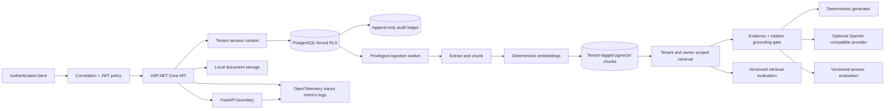

# Enterprise AI Document Assistant

[](https://github.com/mahdiaghtaee/enterprise-ai-document-assistant/actions/workflows/ci.yml)
[](https://github.com/mahdiaghtaee/enterprise-ai-document-assistant/actions/workflows/observability.yml)
[](https://github.com/mahdiaghtaee/enterprise-ai-document-assistant/actions/workflows/retrieval-evaluation.yml)
[](https://github.com/mahdiaghtaee/enterprise-ai-document-assistant/actions/workflows/answer-evaluation.yml)
[](LICENSE)

A local-first reference implementation for tenant-isolated document ingestion, durable background processing, persistent semantic retrieval, provider-optional grounded answers, auditable operations, and reproducible quality evaluation.

The repository combines **ASP.NET Core**, **Python FastAPI**, **PostgreSQL with pgvector**, **Redis**, a small Web UI, and **Docker Compose**. The default pipeline is deterministic and runs without paid AI credentials or a telemetry collector. An OpenAI-compatible answer provider is available only through explicit fail-closed configuration.

```text
JWT tenant/user -> Correlated RLS-scoped request -> Durable audit + enqueue ->
Background extraction/indexing -> Tenant-scoped retrieval -> Grounding gate -> Answer + sources
                                      |                         |
                                      +-> Retrieval baseline    +-> Answer baseline
```

## Current Scope

Implemented:

- ASP.NET Core REST API with Swagger/OpenAPI
- fail-closed JWT validation for issuer, audience, signature, lifetime, `sub`, `tenant_id`, and role
- tenant-scoped `User` and `Admin` roles plus explicit cross-tenant `PlatformAdmin`
- immutable document owner and tenant identity derived from JWT claims
- PostgreSQL Row-Level Security on documents, semantic chunks, ingestion jobs, and audit events
- separate non-superuser runtime and privileged PostgreSQL roles
- local document storage and PostgreSQL-backed metadata
- atomic document metadata and initial ingestion-job persistence
- durable `Pending`, `Processing`, `Completed`, and `Failed` job states
- transactional job claiming with PostgreSQL `FOR UPDATE SKIP LOCKED`
- hosted background extraction, chunking, embedding, and semantic-index persistence
- bounded retries, graceful shutdown, and abandoned-job recovery
- authenticated processing-status, semantic search, and grounded Ask endpoints
- deterministic local extractive answer generation as the default
- optional OpenAI-compatible Chat Completions answer generation
- bounded question, source-count, and context-character provider inputs
- untrusted-source prompt boundaries and mandatory `[S#]` citations
- explicit missing, low-confidence, conflicting, and provider-declined evidence outcomes
- controlled timeout, rate-limit, provider-authentication, malformed-response, and ungrounded-response errors
- source metadata preserved independently from provider-generated text and failures
- validated `X-Correlation-ID` generation, echo, log-safe diagnostic linkage, and service propagation
- OpenTelemetry tracing and metrics for ASP.NET Core, HttpClient, runtime, Search, Ask, provider generation, upload, and worker processing
- FastAPI OpenTelemetry request instrumentation and correlation propagation
- optional OTLP/HTTP export while retaining collector-free local execution
- structured JSON console logging with trace, span, correlation digest, document, and job context
- liveness and dependency-aware readiness endpoints
- append-only PostgreSQL audit ledger with forced tenant RLS
- atomic trigger audit for document and ingestion-job state changes
- correlated application audit for list, upload, status, Search, Ask, provider result/failure, and audit access
- tenant-admin audit visibility and explicit PlatformAdmin cross-tenant visibility
- plain-text extraction and deterministic eight-dimensional local embeddings
- configurable in-memory or PostgreSQL/pgvector semantic index
- versioned tenant-safe retrieval corpus and relevance judgments
- repeatable Precision@K, Recall@K, MRR, empty-query, and local latency evaluation
- versioned grounded-answer cases for citation, insufficient evidence, and provider-failure gates
- machine-readable regression baselines, non-zero failure exit codes, and retained CI artifacts
- Docker Compose verification, .NET/Python tests, coverage floors, CodeQL, and Dependency Review

Not implemented yet:

- tenant provisioning, memberships, invitations, domain verification, or quotas
- production identity-provider synchronization, key rotation, or token revocation
- production telemetry backend, dashboards, alerts, or service-level objectives
- audit retention, archival, legal hold, tamper-evident hashing, or external immutable storage
- encrypted document storage and centralized secret management
- approved production provider account or provider-specific factual-accuracy validation
- representative production-scale or statistically validated retrieval/answer evaluation
- PDF, DOCX, OCR, malware scanning, or file-signature validation

Tenant isolation, grounding gates, and durable auditability reduce disclosure and accountability risks, but this reference project must not be used for confidential or regulated documents until identity lifecycle, encryption, secret management, retention, external-provider governance, and operational review are completed. See [SECURITY.md](SECURITY.md).

## Quick Start

### Requirements

- Docker Desktop or Docker Engine with Compose
- Git
- Python 3.11+ for the local token helper and demo script
- .NET SDK 8.0+ for local tests and quality evaluation

### Start the stack

```bash
git clone https://github.com/mahdiaghtaee/enterprise-ai-document-assistant.git
cd enterprise-ai-document-assistant
cp .env.example .env   # Windows PowerShell: Copy-Item .env.example .env
docker compose up --build
```

Docker Compose uses separate local PostgreSQL credentials for the tenant-restricted API path and the privileged worker/platform path. It defaults to deterministic answer generation and does not require a provider credential or telemetry collector.

| Service | Address |
|---|---|
| Web UI | `http://localhost:3000` |
| Swagger / OpenAPI | `http://localhost:5000/swagger` |
| API health | `http://localhost:5000/health` |
| API liveness | `http://localhost:5000/health/live` |
| API readiness | `http://localhost:5000/health/ready` |
| FastAPI health | `http://localhost:8000/health` |

Generate a tenant-scoped development token:

```bash
python scripts/create_dev_token.py --user demo-user --tenant demo-tenant --role User
```

Generate a tenant administrator token:

```bash
python scripts/create_dev_token.py --user demo-admin --tenant demo-tenant --role Admin
```

Paste the token into Swagger or the Web UI. The helper and repository signing key are local-development tools, not an identity provider.

Run the authenticated demo:

```bash
python scripts/demo_flow.py
```

Run the .NET tests:

```bash
dotnet test tests/api-dotnet/EnterpriseDocumentAssistant.Api.Tests.csproj
```

Run the retrieval-quality evaluation:

```bash
dotnet run --project tools/retrieval-evaluation/EnterpriseDocumentAssistant.RetrievalEvaluation.csproj
```

Run the grounded-answer evaluation:

```bash
dotnet run --project tools/answer-evaluation/EnterpriseDocumentAssistant.AnswerEvaluation.csproj
```

The commands write machine-readable reports under `artifacts/` and return a non-zero exit code when committed thresholds regress.

Detailed setup and implementation guidance:

- [Local development](docs/LOCAL_DEVELOPMENT.md)
- [Provider-backed grounded Ask endpoint](docs/RAG_ASK_ENDPOINT.md)
- [Authentication and authorization](docs/AUTHENTICATION_AND_AUTHORIZATION.md)
- [Tenant isolation](docs/TENANT_ISOLATION.md)
- [Health, audit, and observability](docs/HEALTH_AND_OBSERVABILITY.md)
- [Retrieval quality evaluation](docs/RETRIEVAL_EVALUATION.md)

## External Answer Provider

The safe default is:

```text
ANSWER_GENERATION_PROVIDER=Deterministic
```

To select an OpenAI-compatible Chat Completions endpoint, supply all provider values through trusted configuration or secret management:

```text
ANSWER_GENERATION_PROVIDER=OpenAiCompatible
ANSWER_PROVIDER_ENDPOINT=https://provider.example/v1/chat/completions
ANSWER_PROVIDER_API_KEY=<secret>
ANSWER_PROVIDER_MODEL=<model-name>
```

Invalid external-provider configuration stops application startup. Non-loopback provider endpoints must use HTTPS. Activating a provider may transfer the authorized question and selected document excerpts outside the deployment boundary; review data retention, residency, subprocessors, training terms, cost, and contractual controls first.

## Architecture


```mermaid
flowchart LR
    U[Authenticated client] --> C[Correlation + JWT policy]
    C --> A[ASP.NET Core API]
    A --> T[Tenant session context]
    T --> P[(PostgreSQL forced RLS)]
    P --> L[(Append-only audit ledger)]
    A --> S[Local document storage]
    P --> W[Privileged ingestion worker]
    W --> X[Extract and chunk]
    X --> E[Deterministic embeddings]
    E --> V[(Tenant-tagged pgvector chunks)]
    V --> Q[Tenant and owner scoped retrieval]
    Q --> G[Evidence + citation grounding gate]
    G --> D[Deterministic generator]
    G --> M[Optional OpenAI-compatible provider]
    Q --> R[Versioned retrieval evaluation]
    G --> AE[Versioned answer evaluation]
    A --> F[FastAPI boundary]
    A --> O[OpenTelemetry traces metrics logs]
    F --> O
```

The API derives `owner_id` from `sub` and `tenant_id` from the JWT. Runtime PostgreSQL transactions set transaction-local tenant context; forced RLS independently limits documents, chunks, jobs, and audit rows. `User` requests add an owner filter, `Admin` bypasses only the owner filter inside one tenant, and `PlatformAdmin` uses the explicit privileged path.

Retrieved sources are selected before answer generation. The provider never supplies document identifiers or source text in the response contract. The grounding service accepts an answer only when it cites one or more supplied request-local source markers. Missing, weak, or conflicting evidence produces an explicit non-answer.

Every response carries a validated `X-Correlation-ID`. Audit and telemetry record bounded operational metadata but exclude question text, source text, generated answer text, bearer tokens, API keys, and provider response bodies.

Architecture details:

- [Provider-backed grounded Ask endpoint](docs/RAG_ASK_ENDPOINT.md)
- [Health, audit, and observability](docs/HEALTH_AND_OBSERVABILITY.md)
- [Retrieval quality evaluation](docs/RETRIEVAL_EVALUATION.md)
- [Tenant isolation](docs/TENANT_ISOLATION.md)
- [Authentication and authorization](docs/AUTHENTICATION_AND_AUTHORIZATION.md)
- [Architecture overview](docs/ARCHITECTURE.md)
- [pgvector semantic index](docs/PGVECTOR_SCHEMA.md)
- [Background ingestion](docs/BACKGROUND_INGESTION.md)
- [Roadmap](docs/ROADMAP.md)

## API Security and Audit Behavior

Every `/api/documents` endpoint requires `Authorization: Bearer <token>`. Health endpoints remain public.

For document operations:

- `User`: own documents inside the token tenant;
- `Admin`: all owners inside the token tenant;
- `PlatformAdmin`: all tenants through the privileged path;
- missing token: `401`;
- missing required claims or role: `403`;
- document outside authorized owner or tenant scope: `404`.

`GET /api/audit/events` requires `Admin` or `PlatformAdmin`. Tenant administrators see only their tenant through RLS; PlatformAdmin can retrieve cross-tenant records. Application roles have no `UPDATE` or `DELETE` permission on the audit table.

## Verification

CI verifies:

- JWT claim, role, owner, and tenant enforcement;
- forced RLS and non-`BYPASSRLS` runtime roles;
- cross-tenant database read/write rejection;
- valid and invalid correlation identifiers in ASP.NET Core and FastAPI;
- liveness and dependency-aware readiness;
- audit constraints, policies, triggers, and append-only privileges;
- tenant-admin audit isolation and PlatformAdmin visibility;
- exclusion of sensitive query/source/provider content from audit responses;
- successful upload, processing, retrieval, authorization, and persistence after API restart;
- retrieval metric calculations, corpus categories, and committed thresholds;
- deterministic and scripted-provider answer paths;
- provider request shape without real credentials;
- insufficient-evidence behavior for missing, weak, conflicting, and provider-declined evidence;
- rejection of uncited and out-of-range citations;
- controlled provider status/error mapping;
- generation and retention of retrieval and answer evaluation reports.

## Current Limitations

- Only the supported local plain-text extraction path is implemented.
- Tenant lifecycle and membership management are not implemented.
- Privileged worker/platform credentials are loaded by the same API process in Docker Compose; production should separate that trust boundary.
- A collector, telemetry storage, dashboards, alerts, audit retention, and tamper-evident archival are not bundled.
- Token revocation, managed key rotation, encrypted storage, centralized secret management, and external identity-provider integration remain absent.
- The deterministic embedding model and small synthetic evaluation datasets do not establish production accuracy.
- The OpenAI-compatible path validates protocol and grounding controls without calling or endorsing a real provider.
- External-provider data handling and factual quality require deployment-specific approval and evaluation.
- Docker Compose uses development defaults and exposes local ports.

The next engineering priority is tenant provisioning, membership lifecycle, invitation workflows, and separation of the privileged worker trust boundary.

## Repository Structure

| Area | Responsibility |
|---|---|
| `src/api-dotnet/` | Authentication, tenant policies, audit, observability, public API, provider generation, worker, persistence, and retrieval |
| `src/ai-service-python/` | Correlated FastAPI and OpenTelemetry boundary for future Python-specific processing |
| `src/web-ui/` | Authenticated demonstration interface |
| `infra/postgres/` | PostgreSQL roles, RLS, audit, ownership, pgvector, and ingestion initialization |
| `evaluation/retrieval/` | Versioned retrieval corpus, relevance judgments, baseline, and thresholds |
| `evaluation/answers/` | Versioned grounding, insufficient-evidence, and provider-failure cases |
| `tools/retrieval-evaluation/` | Provider-free retrieval evaluation command and metrics |
| `tools/answer-evaluation/` | Credential-free grounded-answer evaluation command and report |
| `tests/api-dotnet/` | API, security, audit, provider, RLS, pipeline, and PostgreSQL lifecycle tests |
| `tests/retrieval-evaluation/` | Retrieval metric, validation, baseline, and empty-query tests |
| `scripts/` | Tenant-aware token helper and end-to-end demo |
| `docs/` | Architecture, security, migrations, providers, observability, evaluation, operations, and roadmap |

## Contributing

Focused contributions are welcome for tenant lifecycle, representative evaluation corpora, approved provider comparisons, audit retention, and safe document-format expansion.

Read [CONTRIBUTING.md](CONTRIBUTING.md) before opening a pull request. Report security-sensitive findings through [SECURITY.md](SECURITY.md).

## License

Released under the [MIT License](LICENSE).
