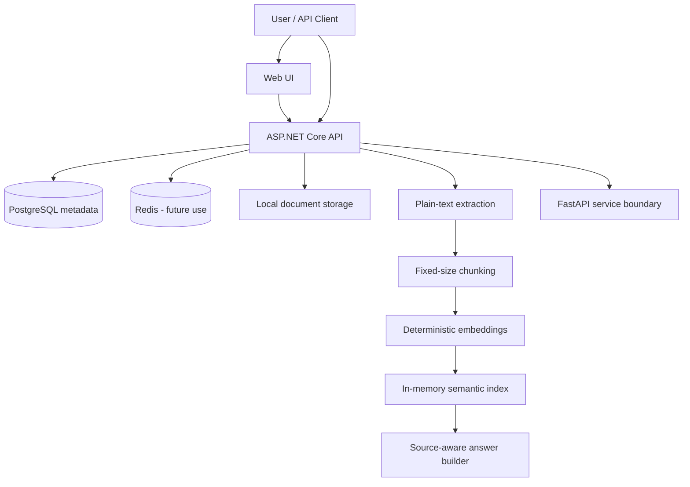

# Architecture Diagram

The diagram below distinguishes current executable responsibilities from planned extensions.

## Current Implementation

### ASP.NET Core API

- upload validation and local storage;
- PostgreSQL-backed document metadata;
- plain-text extraction and chunking;
- deterministic embedding generation;
- in-memory semantic indexing and ranking;
- search and source-aware ask endpoints;
- HTTP call to the FastAPI indexing boundary.

### FastAPI Service

- health endpoint;
- placeholder indexing endpoint returning a queued status.

The FastAPI service does not currently perform extraction, embeddings, retrieval, or answer generation.

### Infrastructure

- PostgreSQL is actively used for document metadata;
- Redis is present but not yet used by the workflow;
- Docker Compose starts the Web UI, API, FastAPI service, PostgreSQL, and Redis.

## Planned Extensions

Planned work includes pgvector persistence, background processing, access control, provider integrations, audit events, and observability. See [ROADMAP.md](ROADMAP.md).
