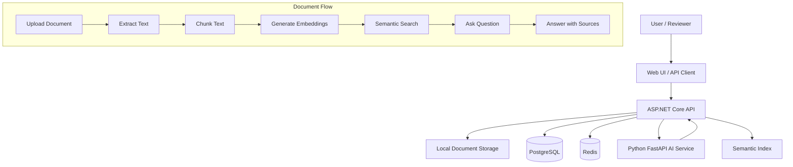

# Architecture Diagram

This diagram shows the intended system shape for the current portfolio-ready version of Enterprise AI Document Assistant.

## Current Implementation

The current implementation already covers:

- ASP.NET Core API
- Python FastAPI service
- Docker Compose environment
- Document upload flow
- Text extraction and chunking
- Deterministic local embeddings
- In-memory semantic index
- Search endpoint
- Ask endpoint with source matches

## Planned Implementation

The next practical improvements are:

- Web UI
- PostgreSQL-backed metadata repository
- Persistent vector storage
- Real embedding provider abstraction
- Authentication
- Background indexing
- Observability
